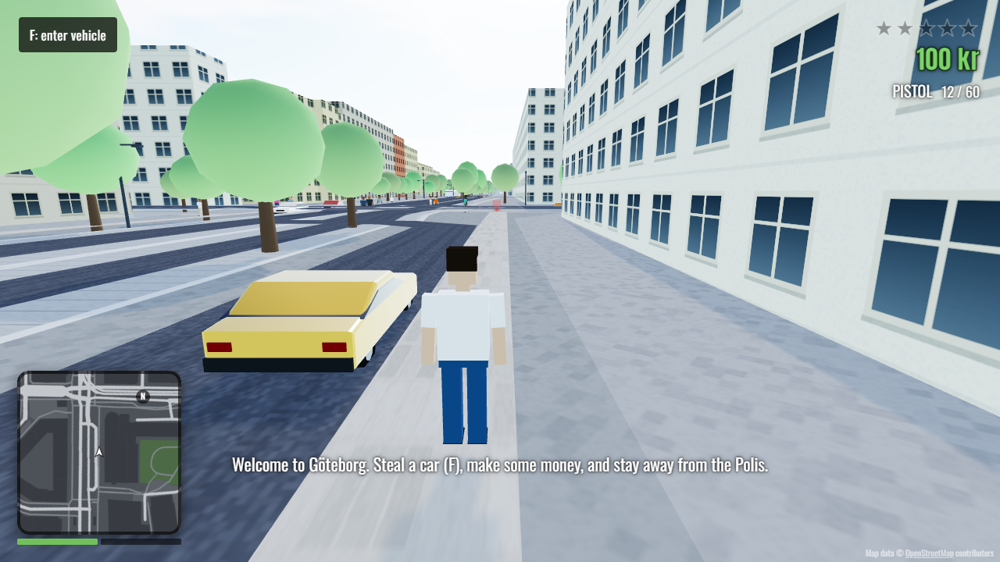

# Grand Theft Göteborg

A small GTA-style open-world game that takes place in the **real world**. The city is generated
from [OpenStreetMap](https://www.openstreetmap.org) data — real streets, buildings (with real
heights where mapped), parks, water, tram lines and district names. You start on
Kungsportsavenyen in Gothenburg, Sweden.

**Play it:** https://mattias800.github.io/minigta/



## What's in it

- **On foot:** third-person movement, sprinting, jumping, swimming.
- **Driving:** arcade car physics with drifting (handbrake), damage, smoke, fire and explosions.
  Cars that end up in Göta älv sink.
- **Carjacking:** walk up to any car and press **F** — drivers get thrown out.
- **Shooting:** fists, pistol, SMG and shotgun, with hit detection against people, cars and buildings.
- **Wanted level (1–5 stars):** crimes raise your heat; police cars are dispatched and pursue you
  through the real street network, officers get out to arrest you (low wanted level) or shoot (higher).
  Break line of sight long enough and the stars fade. **WASTED** respawns you at Sahlgrenska,
  **BUSTED** at Polishuset.
- **A living city:** pedestrians walk the sidewalks and flee from gunfire, traffic follows the lanes
  (right-hand traffic), and Gothenburg's blue-and-white **trams** run on the real tram tracks.
- **HUD:** GTA-style minimap, street and district names as you move, money, wanted stars,
  a procedural in-car radio (three stations), full map (**M**).
- **Anywhere on Earth:** the area around the start is pre-baked; everything else streams live from
  the Overpass API. The pause menu can take you to Stockholm, London, New York, Tokyo, … or start
  anywhere with `?lat=59.3293&lon=18.0686&name=Stockholm`.

All graphics and sounds are procedural (no asset files): geometry is built from map data, textures are
drawn on canvases and audio is synthesized with the Web Audio API.

## Controls

| Key | Action |
| --- | --- |
| W A S D | Move / drive |
| Mouse | Look / aim (click the game to capture the mouse) |
| Left click | Shoot / punch |
| Right click | Aim (over-the-shoulder) |
| Shift | Sprint |
| Space | Jump / handbrake |
| F | Enter / exit / hijack vehicle |
| 1–4, mouse wheel | Switch weapon |
| R | Reload |
| H | Horn |
| Q | Next radio station |
| G | Siren (in police cars) |
| M | Map |
| Esc | Pause |

## Running locally

```bash
npm install
npm run dev        # http://localhost:5173
npm test           # unit tests
npm run build      # production build in dist/
```

### Map data

The pre-baked chunks for central Gothenburg live in `public/data/`. To regenerate them (e.g. after
changing the chunk format or `BAKE_BOUNDS` in `src/config.ts`):

```bash
npm run osm:fetch  # downloads raw OSM tiles into .cache/osm (resumable, retries/splits on errors)
npm run osm:bake   # converts them into public/data/chunks/*.json
```

## How it works

```
src/
  config.ts            origin, spawn, chunk size, bake area
  geo/                 lat/lon ⇄ meters projection, polygon utilities
  world/
    osm/               Overpass client + OSM → chunk processing (shared by the bake tool and the game)
    ChunkSource.ts     baked chunks, or live Overpass fetches cached in IndexedDB
    World.ts           chunk streaming around the player; owns collision, road graph, minimap tiles
    StaticCollision.ts spatial hash of building walls/posts (circle resolution, ray casts, line of sight)
    RoadNetwork.ts     road graph from OSM nodes (nearest-edge queries, A*)
  render/              chunk meshing (extruded buildings, road ribbons, areas), textures, effects
  entities/            Character / Vehicle simulation and their procedural models
  ai/                  pedestrians, traffic drivers, police on foot and in cars, lane following
  game/                game loop & states, combat, police/wanted system, population, trams, pickups
  audio/               synthesized SFX, engine, siren and radio
  ui/                  HUD, minimap, screens
tools/                 fetchOsm.ts and bakeChunks.ts
```

- The world is split into 250 m chunks. Every OSM feature belongs to exactly one chunk (buildings by
  centroid, roads split at nodes, areas clipped), so chunks load/unload independently. Road pieces keep
  OSM node ids, so the road graph reconnects across chunks.
- Systems talk through a small typed event bus (`gunshot`, `death`, `carjack`, …) — e.g. the police
  system turns events into heat, and the population system makes crowds panic.
- AI "brains" drive the same `Character` / `Vehicle` classes the player uses, via intent fields and
  vehicle controls.

## Credits

Map data © [OpenStreetMap contributors](https://www.openstreetmap.org/copyright), available under the
Open Database License (ODbL). The files in `public/data/` are derived from it and remain under the ODbL.

Built with [three.js](https://threejs.org), TypeScript and Vite. Code is MIT licensed.
